# LVitovskyCaseStudy2Unit10
LVitovsky  
July 22, 2016  


##Introduction

This paper seeks to asses the accuracy of three of the many forecasting techniques used by the research team of Amy Wheeler, Nina Weitkamp, Patrick Berlekamp, Johannes Brauer, Andreas Faatz, and Hans-Ulrich Holst (Osnabrück University, 2013) on the export data of three plants of the country "Chulwalar".

"Chulwalar"" is part of an island group "Urbano". The country is known for three types of plants that bloom in winter, the "Efak", the "Wuge", and the "Etel", which grows either blue or red flowers. This paper will focus on on one of these plants, the "Wuge".

The forecasting methods to be reviewed are:

  * Simple Exponential Smoothing
  
  * Holt's Linear Trend Method
  
  * Holt-Winters Seasonal Method (for both additive and multiplicative models)


##Understanding the Data


The original data provided is a time series from 2008 to 2013, and includes not only export data for five plant groups (Efak, Wuge, and Etels, which were reported in total, blue, and red), but fourteen other parameters as well, such as births, national holidays, and inflation rate. 

After reproducing the data tidying, exploratory data analysis, and forecasting performed by the original researchers, here is summary of important points to know about the Wuge plant:
  
  * 1 - The raw data of the Wuge As-is data is not normally distributed, but performing a log transformation does help.
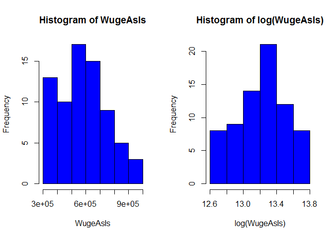<!-- -->

  * 2- A significance test of a linear relationship between the As-is Wuge Export Data and the Planned Wuge Export data produced a **p-value of <2e-16 with 70 degrees of freedom...**

  

```
## 
## t test of coefficients:
## 
##               Estimate Std. Error t value Pr(>|t|)    
## (Intercept) 4.0685e+04 3.8533e+04  1.0559   0.2947    
## TotalPlan   1.8154e-01 1.2563e-02 14.4502   <2e-16 ***
## ---
## Signif. codes:  0 '***' 0.001 '**' 0.01 '*' 0.05 '.' 0.1 ' ' 1
```

Because of these results, we can reject the null hypothesis that there is no linear relationship.  From the data analyzed, there is a slope.  This helps to support the strength of the correlation tests that followed between planned exports and as-is exports, as indicated in the next bullet point.

  * 3- Planned exports for the Wuge mirrored As-is exports very closely, with a **correlation of 0.8788474.**

  * 4- Correlations to each of the fourteen parameters are listed below:

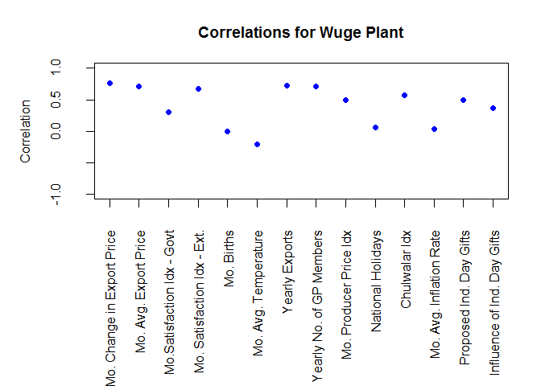<!-- -->

Generally, the Wuge plant exports have the highest correlation to factors involving pricing and the overall health of the economy.  While one might think that births or National Holidays would correlate to Wuge exports, it is not clear if Chulwalar citizens gift these plants to each other, which would not be considered exports, anyway.  Also, the "Planned Spending for Independence Day Presents" could moreso be an indication of economic prosperity, not a direct link to the purchase of Wuge plants for those gifts specifically.  This could actually indicate that Chulwalar citizens are more *able* to purchase presents in general for their own family and friends. More research is needed regarding seasonality.

  * 5- After decomposing the Wuge export time series, one can see a gradual increasing trend, and that the variance of seasonality seems to increase over time. The remainder appears random, which is what we want in order for our three models to be as reliable as possible.

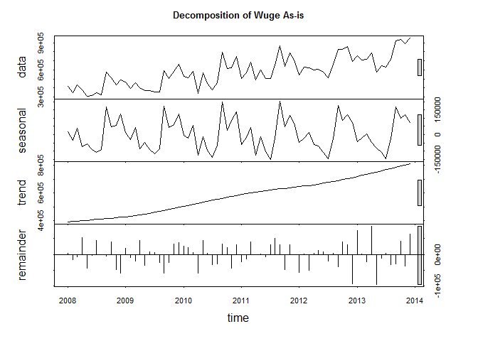<!-- -->

##Accuracy of Forecasting


###Simple Exponential Smoothing

Preliminarily, given the apparent upward trend and seasonality of Wuge exports, it is not likely that SES would prove to be a good method (https://www.otexts.org/fpp/7/1).  But, of course, let us be sure.  Below is plot of Wuge exports in black, with an SES overlay in green. The forecasted exports are in blue.

<!-- -->

Quality measure generated were...


```
##   QualityNames SESMeasures
## 1          AIC    1981.370
## 2         AICc    1981.544
## 3          BIC    1985.923
```

Again, given the data, SES is not suspected to be the best fit, but it needs to be compared to the other models to get a relative sense of its worth.  We will keep moving to see if this method is better than the others...

###Holt's Linear Trend Method

The prospects of this method seem better than SES, given that Holt's can be used on data with a linear trend.  However, it might still not hold true given the seasonality of the Wuge.  Compare the side-by-side plots below.


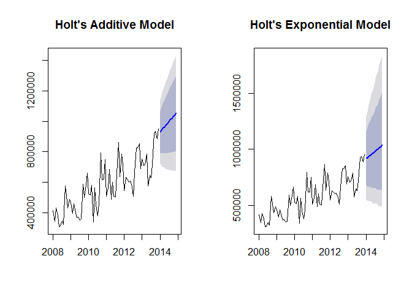<!-- -->

One can see that the forecast for the additive method (bold blue line) trend upward, with somewhat mirrored confidence and prediction intervals.  The multiplicative method has a more muted forecast for the next twelve months of Wuge exports, but more variance it seems with wider confidence and prediction intervals.

If we damp the methods so as to mute the effects of the data the further it is from the current day, our results are the following:

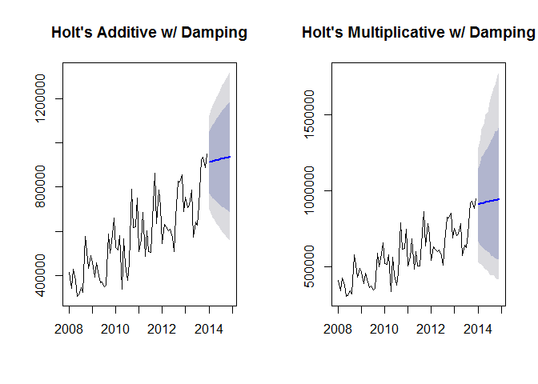<!-- -->

After dampening the trend to avoid too much optimism, the additive method showed a very slight gradual trend upward, and the exponential did the same. However, the exponential method includes much wider confidence and prediction intervals.  While we may have more conservative outlooks with the dampened method, we also are not as confident about forecasted results.

The quality measures generated were:


```
##   QualityNames HoltAdditive HoltExponential HoltAddDamp HoltExpDamp
## 1          AIC     1984.278        1992.221    1986.510    1995.499
## 2         AICc     1984.875        1992.818    1987.419    1996.408
## 3          BIC     1993.385        2001.327    1997.893    2006.883
```

From the numbers generated above, it appears that the Holt's Additive Model has the lowest AIC, AICc, and BIC, making it the best fit from these models.  Of course, there is still more to consider than just these numbers.

###Holt-Winters Seasonal Method

Given the seasonality of the Wuge exports, the expectation is that this method will prove to be more useful than the others. But of course, one must verify.  First we plot the forecasts...

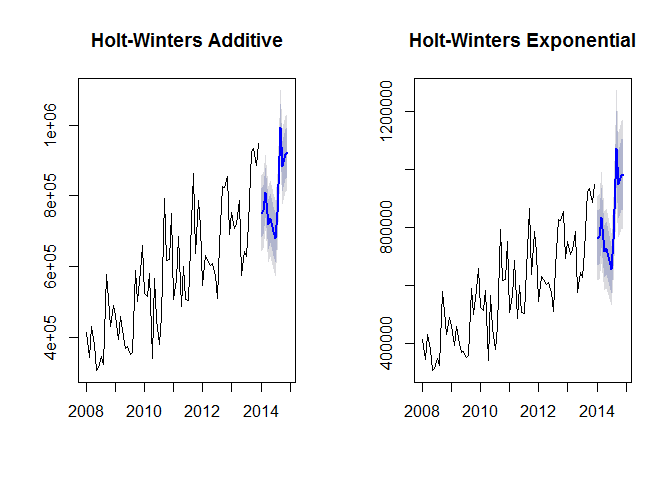<!-- -->

The forecasts here are certainly much closer to the data visually, giving us an expected continued seasonality.  The quality measures for these two methods are below:


```
##   QualityNames HWAdditive HWExponential
## 1          AIC   1910.881      1910.516
## 2         AICc   1920.771      1920.407
## 3          BIC   1947.307      1946.942
```

Among these three quality measurements, the Holt-Winter's Exponential Method appears to be a better fit than the additive.  Given that the seasonality visually appears to increase over time, this makes sense.

Once again, we will damp the method to see if this improves the reliability of the forecasting provided.

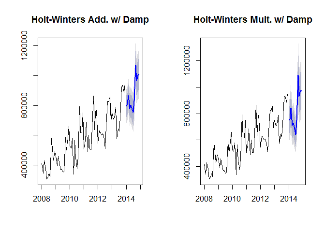<!-- -->

From the plots, it appears that there is more variance in the forecast, confidence, and prediction intervals than in the non-damped methods. The plot below enables us to see all four models on top of each other, so see if the damped methods are more conservative (i.e., less optimisic). 


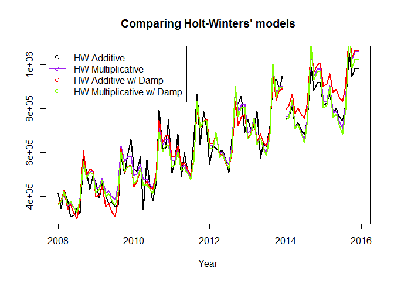<!-- -->

When looking at the plot, the damped additive line (the red line) seems to have the highest end point, but with the least amount of variance.  All other lines seem to still have a good amount of variance comparatively.  Overall, all four lines seem to remain close to each other.

If we review the quality measures, and go ahead and place them next to the non-damped methods that we have already viewed, we have the following:


```
##   QualityNames HWAdditive HWExponential HWAdditiveDamp HWExponentialDamp
## 1          AIC   1910.881      1910.516       1919.078          1919.692
## 2         AICc   1920.771      1920.407       1930.411          1931.025
## 3          BIC   1947.307      1946.942       1957.781          1958.395
```


While dampening is usually preferred when forecasting data, the AIC, AICc, and BIC calculations tell us that they are not as reliable.  Perhaps the increasing seasonality is making it hard to get a good picture of when this will eventually decline.  Perhaps there has been an increased interest in the Wuge plant, and that will not alway be the case.  Of course, we have other metrics we can look at to decide if dampening should actually be used.


##So which one is "best"?

###AIC, AICc, and BIC

As previously states, when reviewing these quality measures, Holt-Winter's stood out as the clear frontrunner with the lowest values for AIC, AICc, and BIC.  More specifically, the Holt-Winter's multiplicative model was slightly lower than the Holt-Winter's additive model.

What is interesting is that while the Holt-Winter's model were undoubtedly better than the Simple Exponential Smoothing or Holt Linear Method, the difference between the additive and multiplicative is not as large.  Also, dampening the Holt-Winter model did not actually deliver better measures here.

###Looking at Error

Perhape reviewing the errors will give more clarity. Seven types of error are outlined below:


```
##              Methods          ME      RMSE      MAE        MPE      MAPE
## 1                SES 14472.94000 108380.50 79591.45 -0.2985412 13.803680
## 2          Holt Add. -7995.95600 107561.60 83814.52 -4.5289970 15.176780
## 3         Holt Mult.  2854.20900 107620.50 83306.45 -2.4762020 14.724290
## 4  Holt Add. w/ Damp  3587.91600 107735.00 82222.70 -2.5905470 14.646430
## 5 Holt Mult. w/ Damp  6750.18800 108003.10 81857.82 -1.8694070 14.430780
## 6          HW's Add.   -63.33698  54690.67 43861.37 -1.3980170  7.977840
## 7         HW's Mult. -4709.47800  54484.25 44908.38 -2.3188600  8.351825
## 8  HW's Add. w/ Damp  7939.67500  57095.66 46556.41  0.4534177  8.459067
## 9 HW's Mult. w/ Damp  8344.00300  58602.93 47747.06  0.2032803  8.478591
##        MASE        ACF1
## 1 0.9695715  0.02262988
## 2 1.0210160  0.05692744
## 3 1.0148270  0.11369070
## 4 1.0162500  0.06340987
## 5 0.9971801  0.06599800
## 6 0.5343129 -0.17759470
## 7 0.5470674 -0.30964900
## 8 0.5671435 -0.18283940
## 9 0.5816478 -0.27984804
```
Generally, the four Holt-Winters models have the smallest errors.  Their Mean Absolute Errors (MAEs) and Mean Absolute Percentage Errors (MAPEs) are about half of the rest of the methods.  The Mean Errors and Root Mean Squared Errors are lower for Holt-Winters as well, but given that they can magnify larger errors (Which there may be for this data given the apparent variance), more trust is placed on the absolute errors.


```
##               Method      MAE     MAPE
## 1          HW's Add. 43861.37 7.977840
## 2         HW's Mult. 44908.38 8.351825
## 3  HW's Add. w/ Damp 46556.41 8.459067
## 4 HW's Mult. w/ Damp 47747.06 8.478591
```


If choosing between a dampening method and not, it appears that the dampened method has more error tied to it.  Perhaps the increasing variance of the seasonality is affecting the ability of the model to provide confidence that those forecasts will materialize.

Between the non-damped Holt-Winters models, the additive model actually had less error associated with it in most cases.  Except for the Root Mean Squared Error, the exponential model had larger errors associated with it (albeit small), despite looking like the better fit when reviewing the quality measures (AIC, etc). So this counters our findings from analyzing the quality measures above.  Perhaps the additive model and exponential models are extremely close.

###Residuals

Investigating the residuals, a plot helps us compare the two models side by side:

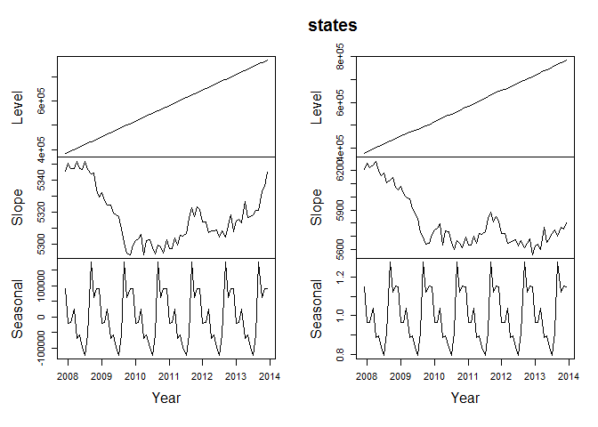<!-- -->

The additive and multiplicative models are extremely close again.  Both have a steady increasing trend, as evidenced by the simple upward line in the "Level" plots.  The slopes are very similar, but still different enough to notice.  It appears that the additive model has a slight "v" shape, almost like a check mark, while the multiplicative model has more of an "L" shape. So the slope seems to increase more over time in the additive model, while it changes less over time in the multiplicative model.

The seasonality is overwhelming in this data.  Perhaps the strength of the seasonality is keeping us from getting a clear answer on which version, additive or multiplicative, of Hunt-Winters' Seasonal model is a better fit.

If we calculate the means and standard deviations of the residuals, we receive the following:
  
  * Means (added damped models just to be sure): 
    
    HW Additive Model: -63.3369775
    
    HW Multiplicative Model: -0.0121928
    
    HW Additive w/ Damp: 7939.6746263
    
    HW Multiplicative w/ Damp: 0.0127785
    
    
  * Standard Deviations:
  
    HW Additive Model: 5.5074432\times 10^{4}
    
    HW Multiplicative Model: 0.0965651
    
    HW Additive w/ Damp : 5.6937706\times 10^{4}
    
    HW Multiplicative w/ Damp: 0.1040631
    
    
Here we see that dampening does not seem to be improving our confidence in the forecasts.  The standard deviations of the dampened models are actually larger, with a larger mean.  There is still conflicting information about additive versus multiplicative, however.  This warrants looking at plots to be sure the visual representation matches the statistics.
    

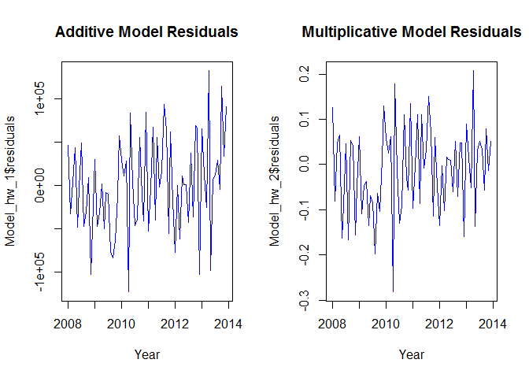<!-- -->

From the side-by-side plots, it appears that the variance in the additive model continues to be a factor, while the multiplicative models is slightly more contained.  Both still have obvious variance, but starting in 2012, it appears that the downward movement of the residuals is not as deep as the additive's.  


##Conclusion

One can easily see that the Holt-Winters' Seasonal Model of forecasting is the best fit of the three tested forecasting techniques.  When choosing to use a dampening or not, given that this does not improve the reliabilty of the data, it is better to keep things simple and not dampen.

However, what is not so clear is if an additive or a multiplicative model should be used.  Taking all of the information presented here into account, it is recommended to use the **additive model**.   It is very close to the mutliplicative results, however, it had slightly **less error** tied to it.  Also, even though the slope of the residuals seemed to be more volatile than the multiplicative, perhaps this is just the true picture of the data given its smaller error measures. To have noticeably more change than another model, but to have less error, indicated to me that the model is a better fit.  It essentially had a "tough" job to do.

Going forward, forecasting for the Wuge plant will be challenging, as its seasonlity appears that it will continue to grow exponenentially.  From a business perspective, this could make the reliability of income from the Wuge less reliable.  Should something cause a high season to be de-railed, it could mean either 1) not being able to meet demand, or 2) having too much Wuges on their hands!

##Appendix

Code used to generate this document is below:


```r
#load correct libraries and the data
#download data, which is in two .csv files, AsIs data and Planned data
#set working directory to proper folder to read in .csv files

#load packages and data
setwd("~/testrepo/CaseStudy2/ChulwalarCase")
library(fpp) # for time series forecasting and analysis
library(forecast) # for some other forecasting models
ImportedAsIsData <- read.csv(file="ImportedAsIsDataChulwalar.csv", 
                             header = F, sep=";", fill = T)
ImportedIndicators <- read.csv(file="ImportedIndicatorsChulwalar.csv", 
                               header = F, sep=";", fill = T)
ImportedPlanData <- read.csv(file="ImportedPlanDataChulwalar.csv", 
                             header = F, sep=";", fill = T)

#check out the data
str(ImportedAsIsData)
```

```
## 'data.frame':	98 obs. of  8 variables:
##  $ V1: Factor w/ 22 levels "","Apr","Aug",..: 19 9 8 13 2 14 11 10 3 18 ...
##  $ V2: int  2008 2313221 1950131 2346635 2039787 1756964 1458302 1679637 1639670 2882886 ...
##  $ V3: int  2009 2610573 2371327 2743786 2125308 1850073 1836222 1797311 1851968 3271171 ...
##  $ V4: int  2010 2760688 2918333 3227041 1613888 2550157 2317645 1474144 2148521 3898571 ...
##  $ V5: int  2011 3112861 2926663 3294784 2577079 2774068 2378227 2222900 2991787 4151531 ...
##  $ V6: int  2012 3093088 3679308 3433364 2714899 3011767 2726028 2483834 3055655 4200796 ...
##  $ V7: int  2013 4119526 3535744 3560974 3760065 2959933 2787898 2828744 3084113 5107775 ...
##  $ V8: int  2014 4308161 4155378 3924332 3659121 3898758 3313891 3595106 3502426 5619059 ...
```

```r
str(ImportedPlanData)
```

```
## 'data.frame':	97 obs. of  8 variables:
##  $ V1: Factor w/ 20 levels "","Apr","Aug",..: 19 7 6 11 2 12 9 8 3 15 ...
##  $ V2: int  2008 2243103 2162705 2720911 2011182 1877757 1819924 1682196 1893171 3325711 ...
##  $ V3: int  2009 2547980 2247049 2731156 2020158 2098038 1927995 1783692 1907705 3124040 ...
##  $ V4: int  2010 2965885 2751170 2906493 2383358 2246893 1992851 2023434 2244997 3257717 ...
##  $ V5: int  2011 3113110 2883766 2957893 2601648 2370949 2339881 2105328 2341623 4086297 ...
##  $ V6: int  2012 3895396 3588151 3787240 3036434 2907891 2707822 2619486 3784557 4987460 ...
##  $ V7: int  2013 3580325 3863212 3606083 3213575 3139128 2998610 2785453 3083654 5143757 ...
##  $ V8: int  2014 4474000 4185565 4278119 3985542 3605973 3515173 3269444 3656112 5637391 ...
```

```r
str(ImportedIndicators)
```

```
## 'data.frame':	195 obs. of  8 variables:
##  $ V1: Factor w/ 28 levels "","Apr","Aug",..: 7 16 12 20 2 19 18 17 3 26 ...
##  $ V2: num  2008 97.4 97.8 98.3 98.1 ...
##  $ V3: num  2009 98.3 98.9 98.7 98.8 ...
##  $ V4: num  2010 99 99.4 99.9 100 ...
##  $ V5: num  2011 101 101 102 102 ...
##  $ V6: num  2012 103 104 104 104 ...
##  $ V7: num  2013 104 105 106 105 ...
##  $ V8: num  2014 NA NA NA NA ...
```

```r
#convert data into vectors
TotalAsIsVector <- c(ImportedAsIsData [2:13,2],
                     ImportedAsIsData [2:13,3],
                     ImportedAsIsData [2:13,4],
                     ImportedAsIsData [2:13,5],
                     ImportedAsIsData [2:13,6],
                     ImportedAsIsData [2:13,7])
WugeAsIsVector <- c(ImportedAsIsData [30:41,2],
                    ImportedAsIsData [30:41,3],
                    ImportedAsIsData [30:41,4],
                    ImportedAsIsData [30:41,5],
                    ImportedAsIsData [30:41,6],
                    ImportedAsIsData [30:41,7])
YearAsIsVector <- c(ImportedAsIsData [86,2],
                    ImportedAsIsData [86,3],
                    ImportedAsIsData [86,4],
                    ImportedAsIsData [86,5],
                    ImportedAsIsData [86,6],
                    ImportedAsIsData [86,7])
TotalAsIsVector_2014 <- c(ImportedAsIsData[2:13,8])
PlanVector <- c(ImportedPlanData[2:13,2],
                ImportedPlanData[2:13,3],
                ImportedPlanData[2:13,4],
                ImportedPlanData[2:13,5],
                ImportedPlanData[2:13,6],
                ImportedPlanData[2:13,7])
WugePlanVector <- c(ImportedPlanData[30:41,2],
                    ImportedPlanData[30:41,3],
                    ImportedPlanData[30:41,4],
                    ImportedPlanData[30:41,5],
                    ImportedPlanData[30:41,6],
                    ImportedPlanData[30:41,7])
YearPlanVector <- c(ImportedPlanData[86,2],
                    ImportedPlanData[86,3],
                    ImportedPlanData[86,4],
                    ImportedPlanData[86,5],
                    ImportedPlanData[86,6],
                    ImportedPlanData[86,7])
PlanVector_2014 <- c(ImportedPlanData[2:13,8])

# The data is saved as a vector and needs to be converted into a time series
TotalAsIs<- ts(TotalAsIsVector , start=c(2008,1), 
               end=c(2013,12), frequency=12)
WugeAsIs <- ts(WugeAsIsVector, start=c(2008,1), 
               end=c(2013,12), frequency=12)
YearAsIs <- ts(YearAsIsVector, start=c(2008,1), 
               end=c(2013,12), frequency=12)
TotalAsIs_2014 <- ts(TotalAsIsVector_2014, start=c(2014,1), 
                     end=c(2014,12), frequency=12)
TotalPlan <- ts(PlanVector , start=c(2008,1), 
                end=c(2013,12), frequency=12)
WugePlan <- ts(WugePlanVector, start=c(2008,1), 
               end=c(2013,12), frequency=12)
YearPlan <- ts(YearPlanVector, start=c(2008,1), 
               end=c(2013,12), frequency=12)
TotalPlan_2014 <- ts(PlanVector_2014, start=c(2014,1), 
                     end=c(2014,12), frequency=12)

#check out the data to make sure it's right
str(TotalAsIs)
```

```
##  Time-Series [1:72] from 2008 to 2014: 2313221 1950131 2346635 2039787 1756964 1458302 1679637 1639670 2882886 2959716 ...
```

```r
str(WugeAsIs)
```

```
##  Time-Series [1:72] from 2008 to 2014: 414571 344579 429907 379606 305697 314582 346800 323618 578252 510031 ...
```

```r
str(YearAsIs)
```

```
##  Time-Series [1:72] from 2008 to 2014: 26280011 29609916 32726772 37215503 40629676 45408410 26280011 29609916 32726772 37215503 ...
```

```r
str(TotalAsIs_2014)
```

```
##  Time-Series [1:12] from 2014 to 2015: 4308161 4155378 3924332 3659121 3898758 3313891 3595106 3502426 5619059 5274287 ...
```

```r
str(TotalPlan)
```

```
##  Time-Series [1:72] from 2008 to 2014: 2243103 2162705 2720911 2011182 1877757 1819924 1682196 1893171 3325711 2662148 ...
```

```r
str(WugePlan) 
```

```
##  Time-Series [1:72] from 2008 to 2014: 424190 388688 457796 363828 364246 358439 321255 370153 645618 470648 ...
```

```r
str(YearPlan)
```

```
##  Time-Series [1:72] from 2008 to 2014: 27883407 29387100 32780247 35224132 43947063 44152007 27883407 29387100 32780247 35224132 ...
```

```r
str(TotalPlan_2014)
```

```
##  Time-Series [1:12] from 2014 to 2015: 4474000 4185565 4278119 3985542 3605973 3515173 3269444 3656112 5637391 5157781 ...
```

```r
#EDA code
#code from WWBBFH analysis
# Test the correlation between As Is and Plan data in order to test how exact 
# the planning is. 
# Correlation is a measure of linear relationship between two variables. 

TotalCor <- cor(TotalAsIs, TotalPlan )
WugeCor <- cor(WugeAsIs, WugePlan)


# The results show a very high planning accuracy.

#fit a linear model to Total AsIs
WugeAsIs_lm <- lm(WugeAsIs ~ WugePlan , data = WugeAsIs)
summary(WugeAsIs_lm)
```

```
## 
## Call:
## lm(formula = WugeAsIs ~ WugePlan, data = WugeAsIs)
## 
## Residuals:
##     Min      1Q  Median      3Q     Max 
## -225162  -55052   -2998   32989  204947 
## 
## Coefficients:
##              Estimate Std. Error t value Pr(>|t|)    
## (Intercept) 4.620e+04  3.582e+04    1.29    0.201    
## WugePlan    9.178e-01  5.955e-02   15.41   <2e-16 ***
## ---
## Signif. codes:  0 '***' 0.001 '**' 0.01 '*' 0.05 '.' 0.1 ' ' 1
## 
## Residual standard error: 80220 on 70 degrees of freedom
## Multiple R-squared:  0.7724,	Adjusted R-squared:  0.7691 
## F-statistic: 237.5 on 1 and 70 DF,  p-value: < 2.2e-16
```

```r
#fit the linear model TotalAsIs_lm to a time series
WugeAsIs_tslm <- tslm(WugeAsIs ~ TotalPlan)
summary(WugeAsIs_lm)
```

```
## 
## Call:
## lm(formula = WugeAsIs ~ WugePlan, data = WugeAsIs)
## 
## Residuals:
##     Min      1Q  Median      3Q     Max 
## -225162  -55052   -2998   32989  204947 
## 
## Coefficients:
##              Estimate Std. Error t value Pr(>|t|)    
## (Intercept) 4.620e+04  3.582e+04    1.29    0.201    
## WugePlan    9.178e-01  5.955e-02   15.41   <2e-16 ***
## ---
## Signif. codes:  0 '***' 0.001 '**' 0.01 '*' 0.05 '.' 0.1 ' ' 1
## 
## Residual standard error: 80220 on 70 degrees of freedom
## Multiple R-squared:  0.7724,	Adjusted R-squared:  0.7691 
## F-statistic: 237.5 on 1 and 70 DF,  p-value: < 2.2e-16
```

```r
#use STL to breakdown seasonality, trend, and remainder
WugeAsIs_stl <- stl(WugeAsIs, s.window=5)


#review STL results on a plot

plot(WugeAsIs_stl, col="black", main="WugeAsIs_stl")
```

<!-- -->

```r
#look at trend for Wuge
par(mfrow=c(1,1), mar=c(6,4,1,1))
plot(WugeAsIs_stl$time.series[,"trend"], col="blue", main="Wuge Trend")
```

<!-- -->

```r
#compare the seasonality.  "It only makes sense to do 
#this if the seasonality componant as the trend looks almost identical and 
#the remainder is then randomly spread."

monthplot(WugeAsIs_stl$time.series[,"seasonal"], main="Monthly Seasonality", ylab="Seasonal")
```

<!-- -->

```r
## Correlation with external indicators

#The indicators are as follows:
  
#Monthly Change in Export Price Index (CEPI)
#Monthly Satisfaction Index (SI) government based data
#Average monthly temperatures in Chulwalar
#Monthly births in Chulwalar
#Monthly Satisfaction Index (SI) external index 
#Yearly Exports from Urbano
#Yearly number of Globalisation Party members in Chulwalar
#Monthly Average Export Price Index for Chulwalar
#Monthly Producer Price Index (PPI) for Etel in Chulwalar
#National Holidays
#Chulwalar Index (Total value of all companies in Chulwalar)
#Monthly Inflation rate in Chulwalar
#Proposed spending for National Holidays
#Influence of National Holiday

#The indicators will be converted into individual  vectors and subsequently converted into time series. The correlation of the indicators will then be tested against the As Is exports for Chulwalar. 

# Monthly Change in Export Price Index (CEPI)
CEPIVector <- c(ImportedIndicators[2:13,2],ImportedIndicators[2:13,3],ImportedIndicators[2:13,4],ImportedIndicators[2:13,5],ImportedIndicators[2:13,6],ImportedIndicators[2:13,7])
CEPI <- ts(CEPIVector , start=c(2008,1), end=c(2013,12), frequency=12)
plot(CEPI, main="CEPI")
```

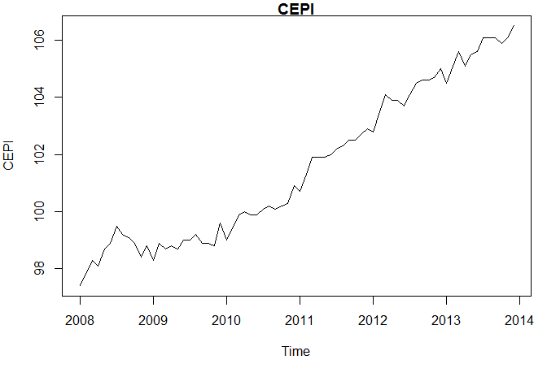<!-- -->

```r
WugeCEPICor <- cor(WugeAsIs, CEPI)

# Monthly Satisfaction Index (SI) government based data
SIGovVector <- c(ImportedIndicators[16:27,2],ImportedIndicators[16:27,3],ImportedIndicators[16:27,4],ImportedIndicators[16:27,5],ImportedIndicators[16:27,6],ImportedIndicators[16:27,7])
SIGov <- ts(SIGovVector , start=c(2008,1), end=c(2013,12), frequency=12)
plot(SIGov, main="SIGov")
```

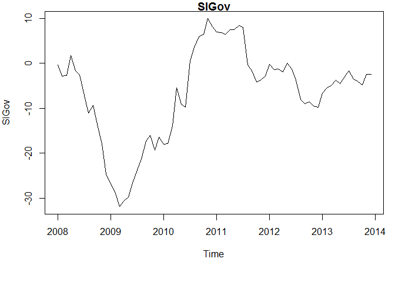<!-- -->

```r
WugeSICor <- cor(WugeAsIs, SIGov)

# Average monthly temperatures in Chulwalar
TemperatureVector <- c(ImportedIndicators[30:41,2],ImportedIndicators[30:41,3],ImportedIndicators[30:41,4],ImportedIndicators[30:41,5],ImportedIndicators[30:41,6],ImportedIndicators[30:41,7])
Temperature <- ts(TemperatureVector, start=c(2008,1), end=c(2013,12), frequency=12)
plot(Temperature, main="Temperature")
```

<!-- -->

```r
WugeTempCor <- cor(WugeAsIs, Temperature)

# Monthly births in Chulwalar 
BirthsVector <- c(ImportedIndicators[44:55,2],ImportedIndicators[44:55,3],ImportedIndicators[44:55,4],ImportedIndicators[44:55,5],ImportedIndicators[44:55,6],ImportedIndicators[44:55,7])
Births <- ts(BirthsVector, start=c(2008,1), end=c(2013,12), frequency=12)
plot(Births, main="Births")
```

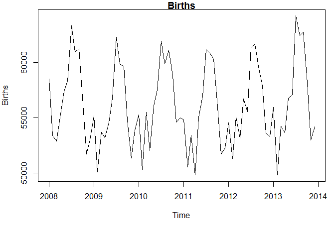<!-- -->

```r
WugeBirthCor <- cor(WugeAsIs, Births)

# Monthly Satisfaction Index (SI) external index 
SIExternVector <- c(ImportedIndicators[58:69,2],ImportedIndicators[58:69,3],ImportedIndicators[58:69,4],ImportedIndicators[58:69,5],ImportedIndicators[58:69,6],ImportedIndicators[58:69,7])
SIExtern <- ts(SIExternVector, start=c(2008,1), end=c(2013,12), frequency=12)
plot(SIExtern, main="SIExtern")
```

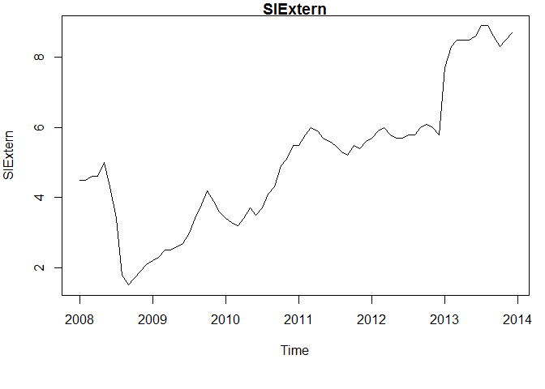<!-- -->

```r
WugeSIECor <- cor(WugeAsIs, SIExtern)

# Yearly exports from Urbano
UrbanoExportsVector <- c(ImportedIndicators[72:83,2],ImportedIndicators[72:83,3],ImportedIndicators[72:83,4],ImportedIndicators[72:83,5],ImportedIndicators[72:83,6],ImportedIndicators[72:83,7])
UrbanoExports <- ts(UrbanoExportsVector, start=c(2008,1), end=c(2013,12), frequency=12)
plot(UrbanoExports, main="UrbanoExports")
```

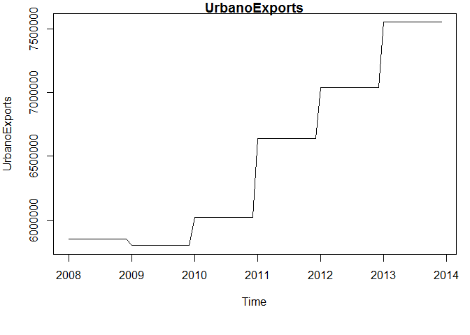<!-- -->

```r
WugeExpCor <- cor(WugeAsIs, UrbanoExports)

# Yearly number of Globalisation Party members in Chulwalar
GlobalisationPartyMembersVector <- c(ImportedIndicators[86:97,2],ImportedIndicators[86:97,3],ImportedIndicators[86:97,4],ImportedIndicators[86:97,5],ImportedIndicators[86:97,6],ImportedIndicators[86:97,7])
GlobalisationPartyMembers <- ts(GlobalisationPartyMembersVector, start=c(2008,1), end=c(2013,12), frequency=12)
plot(GlobalisationPartyMembers, main="GlobalisationPartyMembers")
```

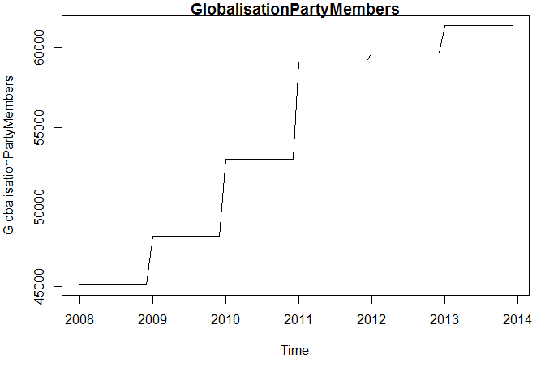<!-- -->

```r
WugeGloCor <- cor(WugeAsIs, GlobalisationPartyMembers)

# Monthly Average Export Price Index for Chulwalar
AEPIVector <- c(ImportedIndicators[100:111,2],ImportedIndicators[100:111,3],ImportedIndicators[100:111,4],ImportedIndicators[100:111,5],ImportedIndicators[100:111,6],ImportedIndicators[100:111,7])
AEPI <- ts(AEPIVector, start=c(2008,1), end=c(2013,12), frequency=12)
plot(AEPI, main="AEPI")
```

<!-- -->

```r
WugeAEPICor <- cor(WugeAsIs, AEPI)

# Monthly Producer Price Index (PPI) for Etel in Chulwalar
PPIEtelVector <- c(ImportedIndicators[114:125,2],ImportedIndicators[114:125,3],ImportedIndicators[114:125,4],ImportedIndicators[114:125,5],ImportedIndicators[114:125,6],ImportedIndicators[114:125,7])
PPIEtel <- ts(PPIEtelVector, start=c(2008,1), end=c(2013,12), frequency=12)
plot(PPIEtel, main="PPIEtel")
```

<!-- -->

```r
WugePPICor <- cor(WugeAsIs, PPIEtel)

# National Holidays
NationalHolidaysVector <- c(ImportedIndicators[170:181,2],ImportedIndicators[170:181,3],ImportedIndicators[170:181,4],ImportedIndicators[170:181,5],ImportedIndicators[170:181,6],ImportedIndicators[170:181,7])
NationalHolidays <- ts(NationalHolidaysVector, start=c(2008,1), end=c(2013,12), frequency=12)
plot(NationalHolidays, main="NationalHolidays")
```

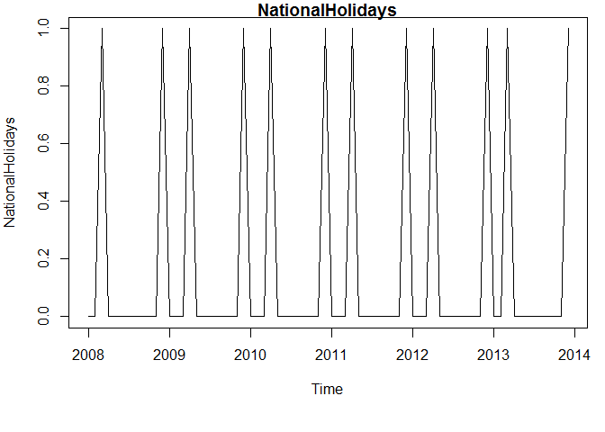<!-- -->

```r
WugeNatCor <- cor(WugeAsIs, NationalHolidays)

# Chulwalar Index (Total value of all companies in Chulwalar)
ChulwalarIndexVector <- c(ImportedIndicators[128:139,2],ImportedIndicators[128:139,3],ImportedIndicators[128:139,4],ImportedIndicators[128:139,5],ImportedIndicators[128:139,6],ImportedIndicators[128:139,7])
ChulwalarIndex <- ts(ChulwalarIndexVector, start=c(2008,1), end=c(2013,12), frequency=12)
plot(ChulwalarIndex, main="ChulwalarIndex")
```

<!-- -->

```r
WugeIdxCor <- cor(WugeAsIs, ChulwalarIndex)

# Monthly Inflation rate in Chulwalar 
InflationVector <- c(ImportedIndicators[142:153,2],ImportedIndicators[142:153,3],ImportedIndicators[142:153,4],ImportedIndicators[142:153,5],ImportedIndicators[142:153,6],ImportedIndicators[142:153,7])
Inflation <- ts(InflationVector, start=c(2008,1), end=c(2013,12), frequency=12)
plot(Inflation, main="Inflation")
```

<!-- -->

```r
WugeInfCor <- cor(WugeAsIs, Inflation)


# Proposed spending for Independence day presents
IndependenceDayPresentsVector <- c(ImportedIndicators[156:167,2],ImportedIndicators[156:167,3],ImportedIndicators[156:167,4],ImportedIndicators[156:167,5],ImportedIndicators[156:167,6],ImportedIndicators[156:167,7])
IndependenceDayPresents <- ts(IndependenceDayPresentsVector, start=c(2008,1), end=c(2013,12), frequency=12)
plot(IndependenceDayPresents, main="IndependenceDayPresents")
```

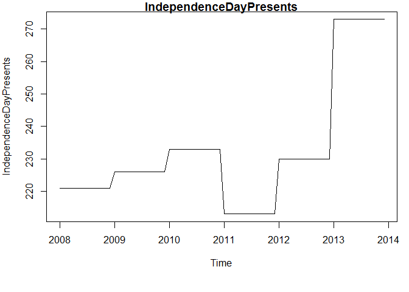<!-- -->

```r
WugeIndCor <- cor(WugeAsIs, IndependenceDayPresents)

# Influence of National Holidays :
#This indicator is an experiment where the influence of National Holidays is 
#extended into the months leading up to the holiday. However later tests show 
#that this indicator is no better for forecasting than the orignial National 
#Holidays indicator.  

InfluenceNationalHolidaysVector <- c(ImportedIndicators[184:195,2],ImportedIndicators[184:195,3],ImportedIndicators[184:195,4],ImportedIndicators[184:195,5],ImportedIndicators[184:195,6],ImportedIndicators[184:195,7])
InfluenceNationalHolidays <- ts(InfluenceNationalHolidaysVector, start=c(2008,1), end=c(2013,12), frequency=12)
plot(InfluenceNationalHolidays, main="InfluenceNationalHolidays")
```

<!-- -->

```r
WugeIndCor2 <- cor(WugeAsIs, InfluenceNationalHolidays)
par(mfrow=c(1,1), mar = c(12,6,4,2) + 0.1, mgp = c(4,2,0))
Correlations <- c(WugeCEPICor, WugeExpCor, WugeSICor, WugeSIECor, WugeBirthCor, WugeTempCor, WugeGloCor, WugeAEPICor, WugePPICor, WugeNatCor, WugeIdxCor, WugeInfCor, WugeIndCor, WugeIndCor2 )
ParamNames <- c("Mo. Change in Export Price", "Mo. Avg. Export Price", "Mo.Satisfaction Idx - Govt", "Mo. Satisfaction Idx - Ext.", "Mo. Births", "Mo. Avg. Temperature", "Yearly Exports", "Yearly No. of GP Members", "Mo. Producer Price Idx", "National Holidays", "Chulwalar Idx", "Mo. Avg. Inflation Rate", "Proposed Ind. Day Gifts", "Influence of Ind. Day Gifts")
plot(Correlations, main="Correlations for Wuge Plant", xaxt="n", pch=19,col="blue", ylim=c(-1, 1), xlab = "", ylab="Correlation")
axis(1, labels = ParamNames, at=1:14, las=2)
```

<!-- -->

```r
# Check that the data import has worked
str(CEPIVector)
```

```
##  num [1:72] 97.4 97.8 98.3 98.1 98.7 98.9 99.5 99.2 99.1 98.9 ...
```

```r
str(SIGovVector)  
```

```
##  num [1:72] -0.4 -2.9 -2.7 1.7 -1.7 -2.6 -7.1 -11.1 -9.4 -13.5 ...
```

```r
str(TemperatureVector) 
```

```
##  num [1:72] 3.6 3.7 4.2 7.6 14.5 16.9 18 17.4 12.4 9.1 ...
```

```r
str(BirthsVector)
```

```
##  num [1:72] 58519 53370 52852 55048 57398 ...
```

```r
str(SIExternVector)
```

```
##  num [1:72] 4.5 4.5 4.6 4.6 5 4.3 3.4 1.8 1.5 1.7 ...
```

```r
str(UrbanoExportsVector) 
```

```
##  num [1:72] 5850000 5850000 5850000 5850000 5850000 5850000 5850000 5850000 5850000 5850000 ...
```

```r
str(GlobalisationPartyMembersVector)
```

```
##  num [1:72] 45089 45089 45089 45089 45089 ...
```

```r
str(AEPIVector) 
```

```
##  num [1:72] 99 99.3 99.5 99.2 99.5 ...
```

```r
str(PPIEtelVector) 
```

```
##  num [1:72] 100.6 99.7 99.9 99.6 100 ...
```

```r
str(NationalHolidaysVector) 
```

```
##  num [1:72] 0 0 1 0 0 0 0 0 0 0 ...
```

```r
str(ChulwalarIndexVector)
```

```
##  num [1:72] 6852 6748 6535 6949 7097 ...
```

```r
str(InflationVector) 
```

```
##  num [1:72] 2.85 2.84 3.15 2.4 3.03 3.24 3.32 3.12 2.8 2.38 ...
```

```r
str(IndependenceDayPresentsVector)
```

```
##  num [1:72] 221 221 221 221 221 221 221 221 221 221 ...
```

```r
par(mfrow=c(1,1))
#Forecasting work
# Forecasting models with smoothing and related approaches
#Exponential Smoothing uses past values to calculate a forecast. 
#The strength with which each value influences the forecast is 
#weakened with help of a smoothing parameter. Thus we are dealing 
#with a weighted average, whose values fade out the longer ago 
#they were in the past. 

#The Akaike's Information Criterion(AIC/AICc) or the 
#Bayesian Information Criterion (BIC) should be at minimum.


## Simple expontential smoothing 
par(mfrow=c(1,1))
Model_ses <- ses(WugeAsIs, h=12)
summary(Model_ses)
```

```
## 
## Forecast method: Simple exponential smoothing
## 
## Model Information:
## Simple exponential smoothing 
## 
## Call:
##  ses(x = WugeAsIs, h = 12) 
## 
##   Smoothing parameters:
##     alpha = 0.4971 
## 
##   Initial states:
##     l = 394763.3979 
## 
##   sigma:  108380.5
## 
##      AIC     AICc      BIC 
## 1981.370 1981.544 1985.923 
## 
## Error measures:
##                    ME     RMSE      MAE        MPE     MAPE      MASE
## Training set 14472.94 108380.5 79591.45 -0.2985412 13.80368 0.9695715
##                    ACF1
## Training set 0.02262988
## 
## Forecasts:
##          Point Forecast    Lo 80   Hi 80    Lo 95   Hi 95
## Jan 2014       912724.3 773829.2 1051619 700302.5 1125146
## Feb 2014       912724.3 757617.1 1067832 675508.3 1149940
## Mar 2014       912724.3 742946.1 1082503 653070.9 1172378
## Apr 2014       912724.3 729445.7 1096003 632423.9 1193025
## May 2014       912724.3 716873.8 1108575 613196.8 1212252
## Jun 2014       912724.3 705061.6 1120387 595131.5 1230317
## Jul 2014       912724.3 693886.0 1131563 578040.0 1247409
## Aug 2014       912724.3 683254.1 1142195 561779.8 1263669
## Sep 2014       912724.3 673093.4 1152355 546240.4 1279208
## Oct 2014       912724.3 663346.3 1162102 531333.6 1294115
## Nov 2014       912724.3 653966.2 1171482 516987.9 1308461
## Dec 2014       912724.3 644914.4 1180534 503144.3 1322304
```

```r
plot(Model_ses, plot.conf=FALSE, ylab="Wuge Exports Chulwalar", xlab="Year", main="", fcol="white", type="o")
lines(fitted(Model_ses), col="green", type="o")
lines(Model_ses$mean, col="blue", type="o")
legend("topleft",lty=1, col=c(1,"green"), c("data", expression(alpha == 0.497)),pch=1)
```

<!-- -->

```r
## Holt's linear trend method   
# Holt added to the model in order to forecast using trends as well. 
# For this it is necessary to add a beta, which determines the trend. 
# If neither alpha nor beta is stated, both parameters will be optimised 
# using ets(). The trend is exponential if the intercepts(level) and the 
# gradient (slope) are multiplied with eachother. The values are worse. As
# the Beta was very low in the optimisation, the forecast is very similar 
# to the ses() model. 

Model_holt_1 <- holt(WugeAsIs,h=12)
summary(Model_holt_1)
```

```
## 
## Forecast method: Holt's method
## 
## Model Information:
## Holt's method 
## 
## Call:
##  holt(x = WugeAsIs, h = 12) 
## 
##   Smoothing parameters:
##     alpha = 0.4534 
##     beta  = 1e-04 
## 
##   Initial states:
##     l = 365532.1652 
##     b = 11356.1829 
## 
##   sigma:  107561.6
## 
##      AIC     AICc      BIC 
## 1984.278 1984.875 1993.385 
## 
## Error measures:
##                     ME     RMSE      MAE       MPE     MAPE     MASE       ACF1
## Training set -7995.956 107561.6 83814.52 -4.528997 15.17678 1.021016 0.05692744
## 
## Forecasts:
##          Point Forecast    Lo 80   Hi 80    Lo 95   Hi 95
## Jan 2014       930420.2 792574.6 1068266 719603.5 1141237
## Feb 2014       941718.9 790357.4 1093080 710231.5 1173206
## Mar 2014       953017.5 789246.7 1116788 702551.7 1203483
## Apr 2014       964316.1 789007.3 1139625 696204.4 1232428
## May 2014       975614.7 789477.1 1161752 690941.8 1260288
## Jun 2014       986913.3 790538.8 1183288 686584.4 1287242
## Jul 2014       998211.9 792104.1 1204320 682997.2 1313427
## Aug 2014      1009510.5 794104.8 1224916 680075.8 1338945
## Sep 2014      1020809.1 796486.6 1245132 677737.5 1363881
## Oct 2014      1032107.7 799206.0 1265010 675915.2 1388300
## Nov 2014      1043406.4 802226.7 1284586 674553.9 1412259
## Dec 2014      1054705.0 805518.8 1303891 673607.7 1435802
```

```r
plot(Model_holt_1)
```

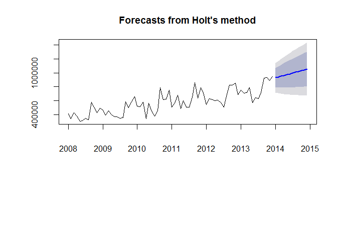<!-- -->

```r
# expoential trend

Model_holt_2<- holt(WugeAsIs, exponential=TRUE,h=12)
summary(Model_holt_2)
```

```
## 
## Forecast method: Holt's method with exponential trend
## 
## Model Information:
## Holt's method with exponential trend 
## 
## Call:
##  holt(x = WugeAsIs, h = 12, exponential = TRUE) 
## 
##   Smoothing parameters:
##     alpha = 0.3883 
##     beta  = 1e-04 
## 
##   Initial states:
##     l = 365932.4618 
##     b = 1.0112 
## 
##   sigma:  0.2034
## 
##      AIC     AICc      BIC 
## 1992.221 1992.818 2001.327 
## 
## Error measures:
##                    ME     RMSE      MAE       MPE     MAPE     MASE      ACF1
## Training set 2854.209 107620.5 83306.45 -2.476202 14.72429 1.014827 0.1136907
## 
## Forecasts:
##          Point Forecast    Lo 80   Hi 80    Lo 95   Hi 95
## Jan 2014       916441.0 674041.8 1147226 559673.4 1280585
## Feb 2014       926772.2 678649.6 1195025 532013.4 1347447
## Mar 2014       937219.9 664702.4 1219327 536908.3 1396376
## Apr 2014       947785.3 662953.2 1253071 528495.5 1449374
## May 2014       958469.9 656407.5 1281780 515182.8 1495477
## Jun 2014       969274.9 647482.4 1312382 524182.7 1546825
## Jul 2014       980201.8 647658.0 1358907 512371.3 1586654
## Aug 2014       991251.8 641592.6 1385354 512950.7 1649595
## Sep 2014      1002426.4 646054.0 1429431 498899.7 1695413
## Oct 2014      1013726.9 632493.8 1433840 491524.5 1749004
## Nov 2014      1025154.9 633917.1 1483642 493074.0 1842933
## Dec 2014      1036711.7 625763.0 1529195 491364.6 1863110
```

```r
plot(Model_holt_2)
```

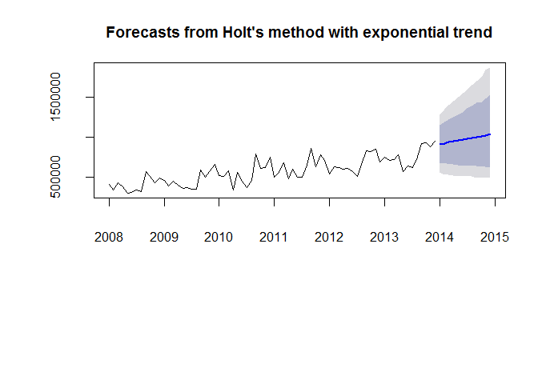<!-- -->

```r
## Dampened trends
# As such simple trends tend to forecast the future too positively, we have 
# added a dampener. This also works for exponential trends. We also plot 
# the level and slope individually for each model.

Model_holt_3 <- holt(WugeAsIs, damped=TRUE,h=12)
summary(Model_holt_3)
```

```
## 
## Forecast method: Damped Holt's method
## 
## Model Information:
## Damped Holt's method 
## 
## Call:
##  holt(x = WugeAsIs, h = 12, damped = TRUE) 
## 
##   Smoothing parameters:
##     alpha = 0.4541 
##     beta  = 1e-04 
##     phi   = 0.98 
## 
##   Initial states:
##     l = 365531.99 
##     b = 11356.6673 
## 
##   sigma:  107735
## 
##      AIC     AICc      BIC 
## 1986.510 1987.419 1997.893 
## 
## Error measures:
##                    ME   RMSE     MAE       MPE     MAPE     MASE       ACF1
## Training set 3587.916 107735 82222.7 -2.590548 14.64643 1.001625 0.06340987
## 
## Forecasts:
##          Point Forecast    Lo 80   Hi 80    Lo 95   Hi 95
## Jan 2014       911578.7 773510.8 1049647 700422.0 1122736
## Feb 2014       914159.0 762509.0 1065809 682230.3 1146088
## Mar 2014       916687.7 752570.9 1080804 665692.7 1167683
## Apr 2014       919165.8 743460.0 1094872 650447.0 1187885
## May 2014       921594.3 735013.9 1108175 636244.1 1206945
## Jun 2014       923974.3 727115.1 1120834 622904.1 1225045
## Jul 2014       926306.7 719675.7 1132938 610291.9 1242321
## Aug 2014       928592.4 712628.0 1144557 598303.3 1258881
## Sep 2014       930832.4 705918.3 1155746 586856.0 1274809
## Oct 2014       933027.6 699503.5 1166552 575883.4 1290172
## Nov 2014       935178.9 693348.3 1177009 565331.0 1305027
## Dec 2014       937287.1 687423.4 1187151 555153.5 1319421
```

```r
plot(Model_holt_3)
```

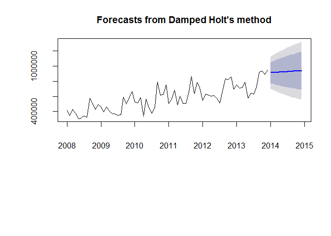<!-- -->

```r
Model_holt_4 <- holt(WugeAsIs, exponential=TRUE, damped=TRUE,h=12)
summary(Model_holt_4)
```

```
## 
## Forecast method: Damped Holt's method with exponential trend
## 
## Model Information:
## Damped Holt's method with exponential trend 
## 
## Call:
##  holt(x = WugeAsIs, h = 12, damped = TRUE, exponential = TRUE) 
## 
##   Smoothing parameters:
##     alpha = 0.45 
##     beta  = 1e-04 
##     phi   = 0.9784 
## 
##   Initial states:
##     l = 365931.7757 
##     b = 1.0176 
## 
##   sigma:  0.2065
## 
##      AIC     AICc      BIC 
## 1995.499 1996.408 2006.883 
## 
## Error measures:
##                    ME     RMSE      MAE       MPE     MAPE      MASE     ACF1
## Training set 6750.188 108003.1 81857.82 -1.869407 14.43078 0.9971801 0.065998
## 
## Forecasts:
##          Point Forecast    Lo 80   Hi 80    Lo 95   Hi 95
## Jan 2014       912008.8 666179.9 1149559 549880.1 1277935
## Feb 2014       915320.8 658211.4 1186236 524864.3 1343378
## Mar 2014       918573.1 643688.0 1204660 509010.0 1378463
## Apr 2014       921766.4 624557.7 1229644 499058.3 1431985
## May 2014       924901.6 606738.5 1268258 473616.1 1486576
## Jun 2014       927979.5 599687.5 1283780 471248.3 1553706
## Jul 2014       931000.9 596468.2 1317538 457392.5 1595872
## Aug 2014       933966.7 578133.3 1345030 447020.7 1649986
## Sep 2014       936877.6 568682.6 1356318 446094.5 1675492
## Oct 2014       939734.5 556776.6 1382262 431053.3 1719918
## Nov 2014       942538.3 553798.8 1402639 420149.6 1766674
## Dec 2014       945289.7 547233.4 1410829 418384.3 1809152
```

```r
plot(Model_holt_4)
```

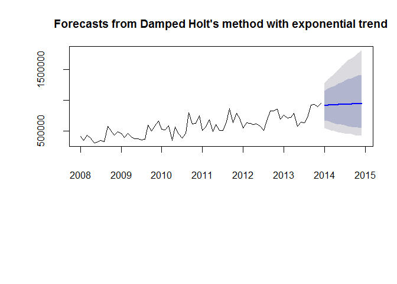<!-- -->

```r
# level and slope can be plotted individually for each model. 
plot(Model_holt_1$model$state)
```

<!-- -->

```r
plot(Model_holt_2$model$state)
```

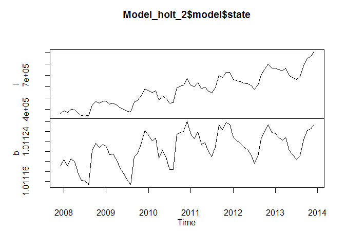<!-- -->

```r
plot(Model_holt_3$model$state)
```

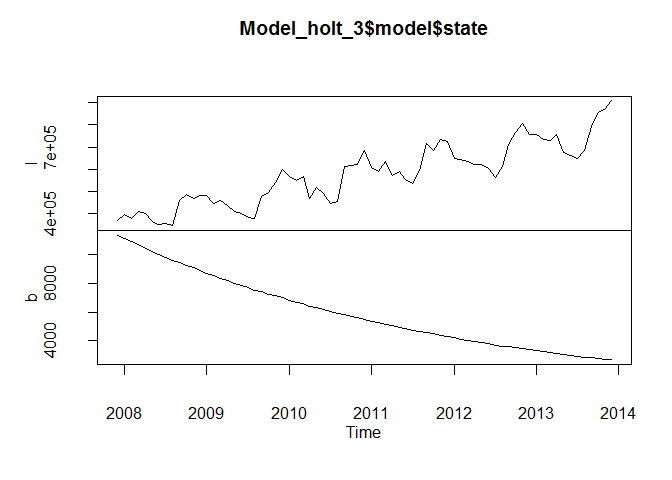<!-- -->

```r
plot(Model_holt_4$model$state)
```

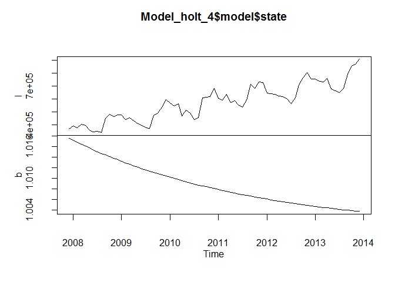<!-- -->

```r
plot(Model_holt_1, plot.conf=FALSE, ylab=" Wuge Exports Chulwalar  )", xlab="Year", main="", fcol="white", type="o")
lines(fitted(Model_ses), col="purple", type="o")
lines(fitted(Model_holt_1), col="blue", type="o")
lines(fitted(Model_holt_2), col="red", type="o")
lines(fitted(Model_holt_3), col="green", type="o")
lines(fitted(Model_holt_4), col="orange", type="o")
lines(Model_ses$mean, col="purple", type="o")
lines(Model_holt_1$mean, col="blue", type="o")
lines(Model_holt_2$mean, col="red", type="o")
lines(Model_holt_3$mean, col="green", type="o")
lines(Model_holt_4$mean, col="orange", type="o")
legend("topleft",lty=1, col=c(1,"purple","blue","red","green","orange"), c("data", "SES","Holts auto", "Exponential", "Additive Damped", "Multiplicative Damped"),pch=1)
```

<!-- -->

```r
## Holt-Winter's seasonal method   
# Holt and Winters have expanded Holt's model further to include
# the seasonality aspect. The parameter gamma, which is for smoothing 
# the seasonality, was added to achieve this. The values are better than 
# the models without seasonality. This is logical, since the data is strongly
# influenced by seasonality.  In the following model, none of the parameters 
# are given so that they will be optimised automatically. There are two models: 
# one using an additive error model method and one using a multiplicative error model. 
# The additive model gives slightly better results than the multiplicative model.

Model_hw_1 <- hw(WugeAsIs ,seasonal="additive",h=12)
summary(Model_hw_1)
```

```
## 
## Forecast method: Holt-Winters' additive method
## 
## Model Information:
## Holt-Winters' additive method 
## 
## Call:
##  hw(x = WugeAsIs, h = 12, seasonal = "additive") 
## 
##   Smoothing parameters:
##     alpha = 1e-04 
##     beta  = 1e-04 
##     gamma = 1e-04 
## 
##   Initial states:
##     l = 384577.2564 
##     b = 5345.5295 
##     s=90434.96 90939.89 62685.76 176495.2 -56313.34 -124136.2
##            -98857.06 -57078.56 -69804.56 25351.75 -18290.68 -21427.11
## 
##   sigma:  54690.67
## 
##      AIC     AICc      BIC 
## 1910.881 1920.771 1947.307 
## 
## Error measures:
##                     ME     RMSE      MAE       MPE    MAPE      MASE       ACF1
## Training set -63.33698 54690.67 43861.37 -1.398017 7.97784 0.5343129 -0.1775947
## 
## Forecasts:
##          Point Forecast    Lo 80     Hi 80    Lo 95     Hi 95
## Jan 2014       751311.9 681223.0  821400.8 644120.2  858503.7
## Feb 2014       759782.5 689693.6  829871.4 652590.8  866974.3
## Mar 2014       808774.4 738685.5  878863.3 701582.7  915966.2
## Apr 2014       718968.0 648879.1  789057.0 611776.3  826159.8
## May 2014       737030.3 666941.3  807119.2 629838.5  844222.0
## Jun 2014       700603.0 630514.0  770691.9 593411.2  807794.8
## Jul 2014       680666.4 610577.4  750755.4 573474.5  787858.2
## Aug 2014       753836.5 683747.5  823925.5 646644.6  861028.4
## Sep 2014       991986.6 921897.5 1062075.6 884794.6 1099178.5
## Oct 2014       883532.8 813443.7  953621.9 776340.8  990724.8
## Nov 2014       917126.0 847036.9  987215.1 809933.9 1024318.1
## Dec 2014       921972.2 851882.9  992061.4 814780.0 1029164.4
```

```r
plot(Model_hw_1)
```

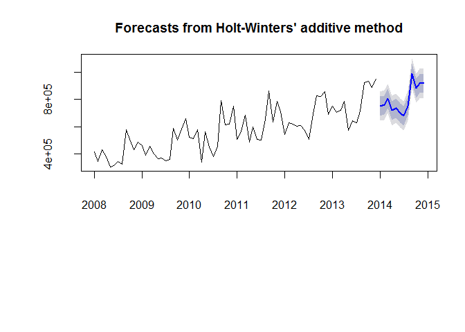<!-- -->

```r
Model_hw_2 <- hw(WugeAsIs ,seasonal="multiplicative",h=12)
summary(Model_hw_2)
```

```
## 
## Forecast method: Holt-Winters' multiplicative method
## 
## Model Information:
## Holt-Winters' multiplicative method 
## 
## Call:
##  hw(x = WugeAsIs, h = 12, seasonal = "multiplicative") 
## 
##   Smoothing parameters:
##     alpha = 0.0243 
##     beta  = 0.0011 
##     gamma = 1e-04 
## 
##   Initial states:
##     l = 375726.9238 
##     b = 6201.6081 
##     s=1.1508 1.1548 1.1234 1.2784 0.9142 0.7926
##            0.8365 0.8951 0.888 1.0388 0.9634 0.9641
## 
##   sigma:  0.0967
## 
##      AIC     AICc      BIC 
## 1910.516 1920.407 1946.942 
## 
## Error measures:
##                     ME     RMSE      MAE       MPE     MAPE      MASE      ACF1
## Training set -4709.478 54484.25 44908.38 -2.231886 8.351825 0.5470674 -0.309649
## 
## Forecasts:
##          Point Forecast    Lo 80     Hi 80    Lo 95     Hi 95
## Jan 2014       762281.5 667849.9  856713.0 617860.8  906702.1
## Feb 2014       767314.6 672229.1  862400.1 621893.9  912735.3
## Mar 2014       833378.6 730071.2  936686.1 675383.5  991373.8
## Apr 2014       717572.2 628587.9  806556.5 581482.5  853661.9
## May 2014       728468.9 638098.2  818839.5 590258.9  866678.8
## Jun 2014       685651.2 600557.4  770745.0 555511.4  815791.0
## Jul 2014       654309.6 573070.1  735549.0 530064.5  778554.6
## Aug 2014       759936.1 665538.6  854333.6 615567.6  904304.6
## Sep 2014      1070161.2 937163.9 1203158.4 866759.4 1273562.9
## Oct 2014       946855.2 829122.2 1064588.1 766798.2 1126912.2
## Nov 2014       980048.4 858123.1 1101973.7 793579.8 1166517.0
## Dec 2014       983372.1 860965.0 1105779.3 796166.6 1170577.7
```

```r
plot(Model_hw_2)
```

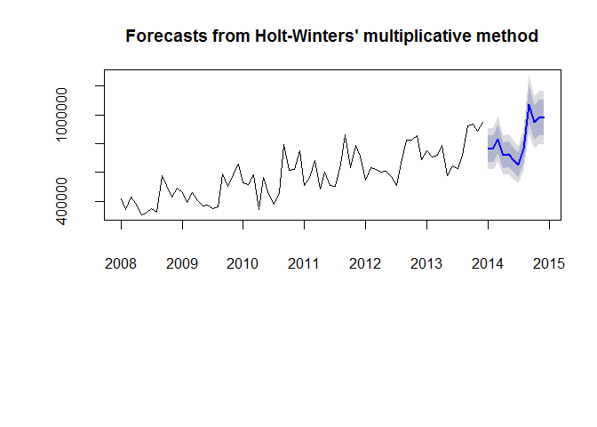<!-- -->

```r
plot(Model_hw_1, ylab="Wuge Exports", plot.conf=FALSE, type="o", fcol="white", xlab="Year")
lines(fitted(Model_hw_1), col="red", lty=2)
lines(fitted(Model_hw_2), col="green", lty=2)
lines(Model_hw_1$mean, type="o", col="red")
lines(Model_hw_2$mean, type="o", col="green")
legend("topleft",lty=1, pch=1, col=1:3, c("data","Holt Winters' Additive","Holt Winters' Multiplicative"))
```

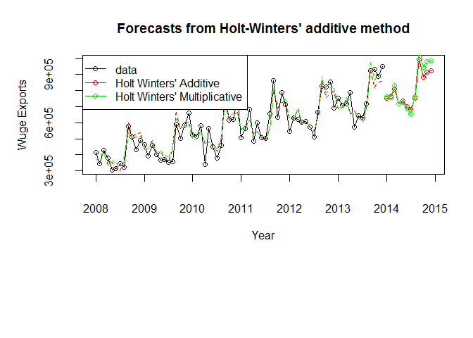<!-- -->

```r
#Damp the Holt-Winter models
Model_hw_3 <- hw(WugeAsIs ,seasonal="additive", damped = TRUE,h=12)
Model_hw_4 <- hw(WugeAsIs ,seasonal="multiplicative", damped = TRUE,h=12)

#create plot to show all HW lines

HW1 <- hw(WugeAsIs, seasonal = "additive")
HW2 <- hw(WugeAsIs, seasonal = "multiplicative")
HW3 <- hw(WugeAsIs, seasonal = "additive", damped = TRUE)
HW4 <- hw(WugeAsIs, seasonal = "multiplicative", damped = TRUE)


# In order to use the results later, they need to be converted into point forecasts.
Model_hw_1_df <-as.data.frame(Model_hw_1) 
Model_hw_1_PointForecast <- ts(Model_hw_1_df$"Point Forecast", start=c(2014,1), end=c(2014,12), frequency=12)
Model_hw_1_PointForecast
```

```
##           Jan      Feb      Mar      Apr      May      Jun      Jul      Aug
## 2014 751311.9 759782.5 808774.4 718968.0 737030.3 700603.0 680666.4 753836.5
##           Sep      Oct      Nov      Dec
## 2014 991986.6 883532.8 917126.0 921972.2
```

```r
Model_hw_2_df <-as.data.frame(Model_hw_2) 
Model_hw_2_PointForecast <- ts(Model_hw_2_df$"Point Forecast", start=c(2014,1), end=c(2014,12), frequency=12)
Model_hw_2_PointForecast
```

```
##            Jan       Feb       Mar       Apr       May       Jun       Jul
## 2014  762281.5  767314.6  833378.6  717572.2  728468.9  685651.2  654309.6
##            Aug       Sep       Oct       Nov       Dec
## 2014  759936.1 1070161.2  946855.2  980048.4  983372.1
```

```r
#measures of quality
QualityNames <- c("AIC", "AICc", "BIC")
SESMeasures <- c(1981.370, 1981.544, 1985.923)
HoltAdditive <- c(1984.278, 1984.875, 1993.385)
HoltExponential <- c(1992.221, 1992.818, 2001.327)
HoltAddDamp <- c(1986.510, 1987.419, 1997.893)
HoltExpDamp <- c(1995.499, 1996.408, 2006.883)
HWAdditive <- c(1910.881, 1920.771, 1947.307)
HWExponential <- c(1910.516, 1920.407, 1946.942)
HWAdditiveDamp <- c(1919.078, 1930.411, 1957.781)
HWExponentialDamp <- c(1919.692, 1931.025, 1958.395)

#info for error information / presentation
ErrorNames <- c("ME", "RMSE", "MAE", "MPE", "MAPE", "MASE", "ACF1")
Methods <- c("SES", "Holt Add.", "Holt Mult.", "Holt Add. w/ Damp", "Holt Mult. w/ Damp", "HW's Add.", "HW's Mult.", "HW's Add. w/ Damp", "HW's Mult. w/ Damp")
ME <- c(14472.94, -7995.956, 2854.209, 3587.916, 6750.188, -63.33698, -4709.478, 7939.675, 8344.003)
RMSE <- c(108380.5, 107561.6, 107620.5, 107735, 108003.1, 54690.67, 54484.25, 57095.66,58602.93)
MAE <- c(79591.45, 83814.52, 83306.45, 82222.7, 81857.82, 43861.37, 44908.38, 46556.41,47747.06)
MPE <- c(-0.2985412, -4.528997, -2.476202, -2.590547, -1.869407, -1.398017, -2.31886, 0.4534177,0.2032803 )
MAPE <- c(13.80368, 15.17678, 14.72429, 14.64643,14.43078, 7.97784, 8.351825, 8.459067,8.478591)
MASE <- c(0.9695715, 1.021016, 1.014827, 1.01625, 0.9971801, 0.5343129, 0.5470674, 0.5671435,0.5816478)
ACF1 <- c(0.02262988, 0.05692744, 0.1136907, 0.06340987, 0.065998, -0.1775947, -0.309649, -0.1828394,-0.27984804)

#info for Holt Winters' errors
Methods2<- c("HW's Add.", "HW's Mult.", "HW's Add. w/ Damp", "HW's Mult. w/ Damp")
HWMAE<- c(43861.37, 44908.38, 46556.41,47747.06)
HWMAPE <- c(7.97784, 8.351825, 8.459067,8.478591)
HWErrors <- data.frame(Methods2, HWMAE, HWMAPE)
names(HWErrors) <- c("Method", "MAE", "MAPE")


#Residuals
#create new set of holt winters models levels, slopes, and seasonals

states <- cbind(Model_hw_1$model$states[,1:3], Model_hw_2$model$states[,1:3])
colnames(states) <- c("Level" , "Slope", "Seasonal", "Level" , "Slope", "Seasonal")
```

